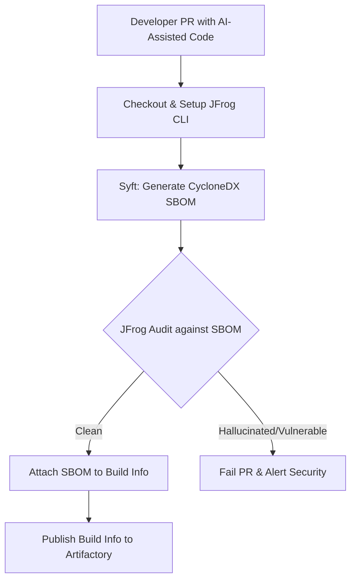

# AI-Code SBOM & DevSecOps Pipeline

A CI/CD pipeline designed to secure the software supply chain in the era of AI-assisted development. As teams rely more on tools like Copilot and Cursor, the risk of introducing hallucinated or vulnerable transitive dependencies increases.

## Architecture Flow

# The Engineering Challenge
AI coding assistants frequently suggest libraries that are outdated, deprecated, or entirely fabricated (hallucinated packages). Traditional security scans often miss these nuanced supply chain risks until they reach production. This pipeline utilizes Syft and JFrog Advanced Security to generate and audit a full dependency tree on every commit.
