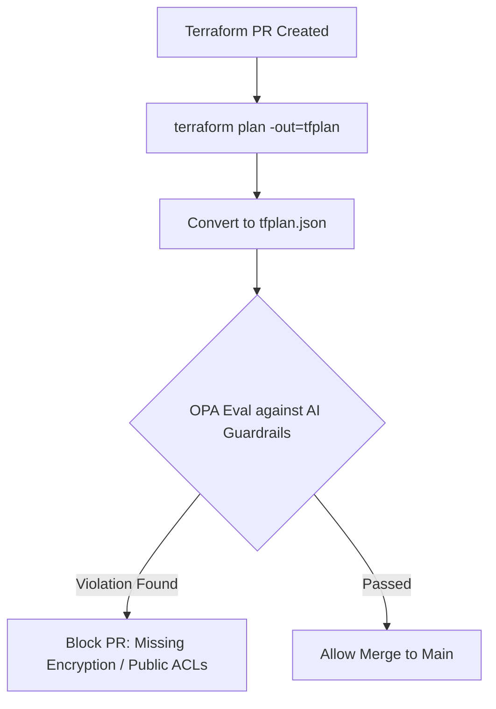

# AI IaC Policy Guardian

A Policy-as-Code framework designed to intercept and remediate misconfigurations in AI-generated Infrastructure as Code (IaC). 

## Architecture Flow

# The Engineering Challenge
LLMs are highly effective at writing Terraform, but they optimize for "making it work" rather than "making it secure." Common hallucinations include missing encryption flags, overly permissive IAM roles, and 0.0.0.0/0 ingress rules. This project utilizes Open Policy Agent (OPA) and custom Rego policies to enforce strict security baselines before any AI-generated IaC is applied.
