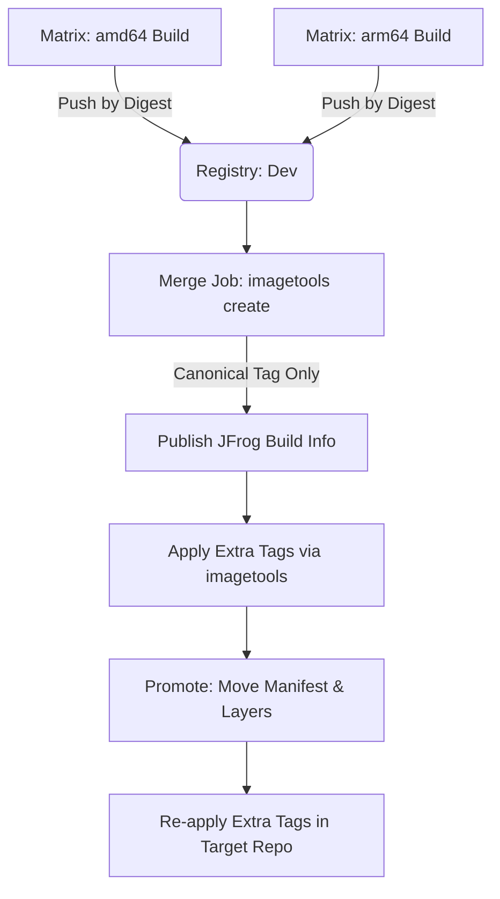

# Multi-Architecture Docker Images: Build Once Across Platforms, Promote Right

### Using Docker Buildx to build and promote truly portable container images from a single runner type — and the promotion pitfalls that affect JFrog, Harbor, ECR, and every other registry.

Every platform team hits this moment eventually. Your pipeline builds a perfect `linux/amd64` image. It works. CI is green. Then your company moves to AWS Graviton nodes, or a dev runs it on an M-series Mac, or you ship to an ARM-based edge device — and nothing works. The obvious fix is adding ARM runners to CI. That is the expensive fix, the slow fix, and honestly, the unnecessary fix.

This guide walks through the complete architecture: building genuine multi-architecture images on **standard amd64 runners only**, using Docker Buildx with QEMU emulation, and promoting them correctly through your SDLC.

## Architecture Flow

# The Build Strategy: Digest-First, Tag-Later
Most documentation shows the naive approach which causes downstream registry and promotion collisions. The correct approach is decoupled: push by digest only, then apply tags in a separate merge step.

Build each platform separately, push by digest: Run a matrix job — one job per platform, same runner type for all. Use push-by-digest=true.

Merge digests into a manifest list: Use docker buildx imagetools create to tie the digests together under ONE canonical tag.

# The Promotion Problem
When you promote a multi-arch image, you aren't moving one file. You are moving the manifest list (the index) PLUS the platform-specific manifests and their layers.

Enterprise registries (like JFrog) pair image storage with a build metadata layer. If your CI pipeline registers build metadata for every tag applied to an image, the promotion job encounters ambiguous records and throws a 400 Bad Request.

# The Universal Pattern for Multi-Tag Promotion:

Promote the canonical tag via whatever tool moves layers natively (docker-promote, skopeo --all).

Update the build record status (if using an artifact manager).

Re-apply extra tags in the target repository as pointers to the promoted digest.

# Key Takeaways
You do not need ARM runners to build linux/arm64 images. QEMU emulation handles cross-compilation efficiently.

Push by digest first, then apply tags in a separate merge step to prevent module duplication.

Extra tags (latest, date tags) must be explicitly re-applied in the target repo after promotion via imagetools create.
